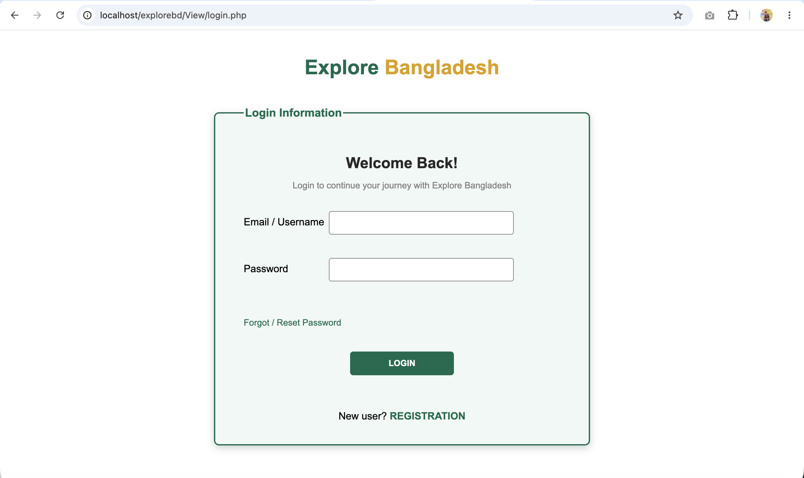
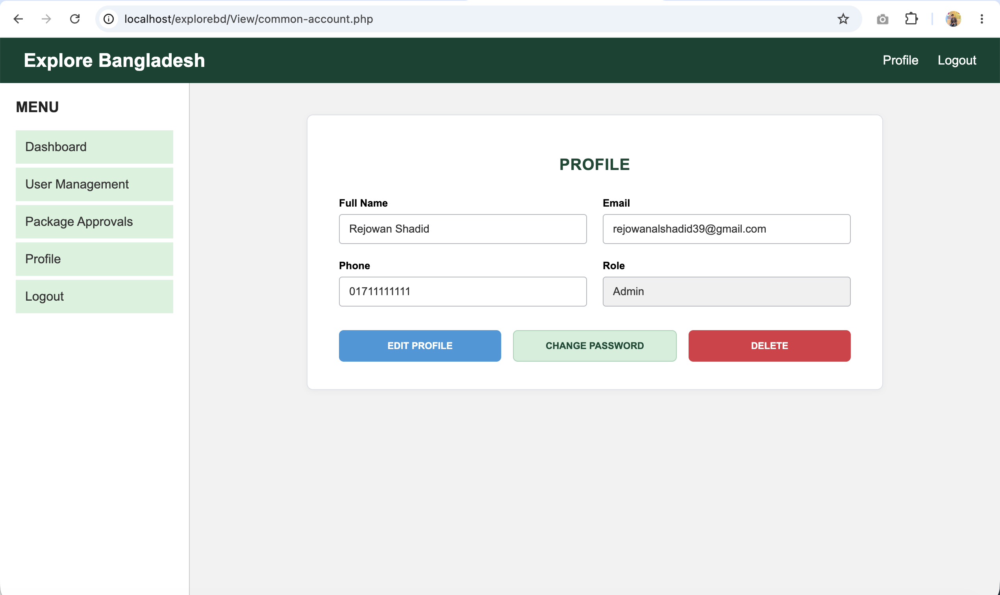
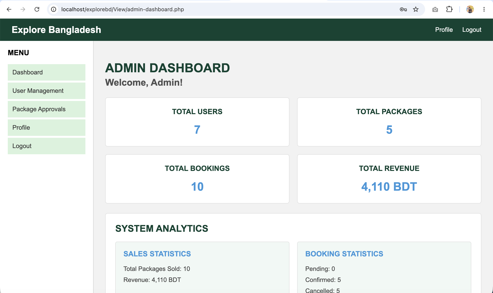
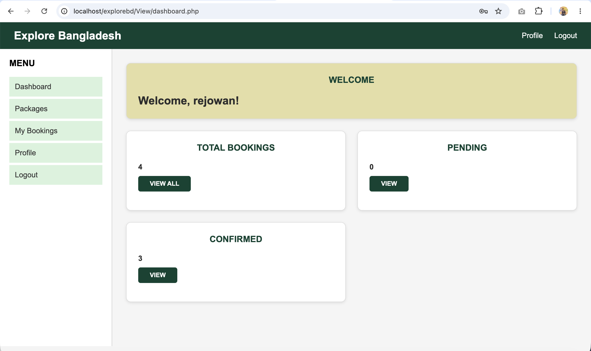
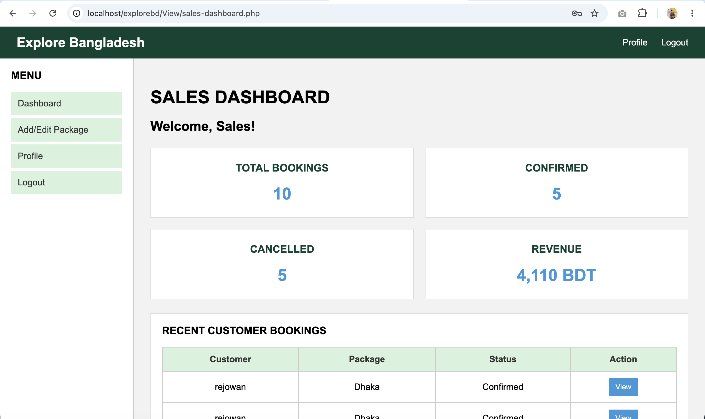

# 🌏 Explore Bangladesh

## 📌 Introduction

**Explore Bangladesh** is a web-based tourism management project designed
to help users discover and explore the beautiful tourist destinations of
Bangladesh.

The project provides information about different tourist destinations,
tour packages, booking facilities, and user account management through a
simple and user-friendly web interface.

---

## 🌐 Live Demo

🔗 **Live Demo:** [Click Here](YOUR_LIVE_DEMO_LINK)

> Replace `YOUR_LIVE_DEMO_LINK` with your actual live website URL.

---

## ✨ Features

- 🔐 User Registration and Login
- 👤 User Profile Management
- 🔑 Forgot Password
- 🗺️ Explore Tourist Destinations
- 📦 Tour Package Management
- 💰 Package Price and Duration Information
- 📝 Tour Package Details and Itinerary
- 🏨 Booking Management
- 👨‍💼 Role-Based Access
- 📊 Sales Package Management
- 🖼️ Destination and Package Images
- 📱 User-Friendly Web Interface

---

## 📁 Project Structure

```text
wtechfinal3/
│
├── Controller/
│   ├── login-controller.php
│   ├── ...
│
├── Model/
│   ├── ...
│
└── View/
    ├── ...

Controller
Contains the PHP files responsible for handling user requests,
form submissions, authentication, and other application logic.
Model
Contains the files responsible for database-related operations
and data management.
View
Contains the user interface pages of the application, including
HTML, CSS, JavaScript, and PHP-based pages.
Database
bdtour.sql contains the SQL database structure and data required
for the project.
🛠️ Technologies Used
Technology	Purpose
PHP	Backend Development
MySQL	Database Management
HTML	Website Structure
CSS	Website Styling
JavaScript	Client-Side Functionality
XAMPP	Local Development Server
## 📸 Screenshots

### 🔐 Login Page



### 👤 Profile Page



### 🛠️ Admin Page



### 👤 Customer Page



### 💼 Sales Page


👥 Team Members
Name	Role
Rejowan Al Shadid	Developer
Frank Heaven Mondol	Developer

Update the team member names and roles according to your project.
🎯 Project Objective
The main objective of Explore Bangladesh is to provide an easy-to-use
online platform where users can explore tourist destinations and tour
packages in Bangladesh.
The project aims to make tourism information more accessible and provide
a convenient way for users to manage their tourism-related activities.
🚀 Future Improvements
Online Payment Integration
Google Maps Integration
Online Hotel Reservation
Tourist Reviews and Ratings
Advanced Search and Filtering
Mobile Application
Email Notifications
Online Booking Confirmation
